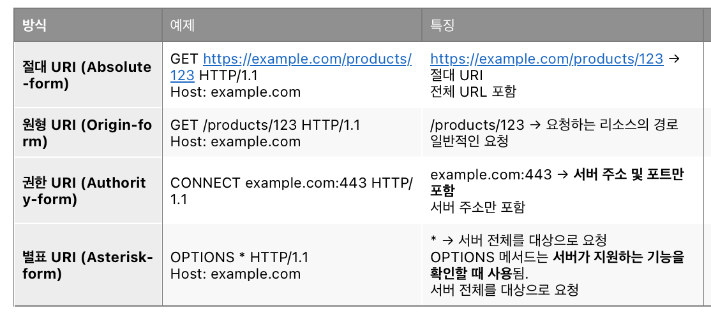
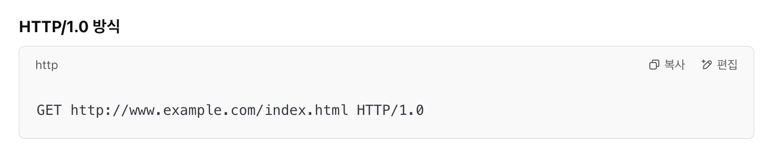
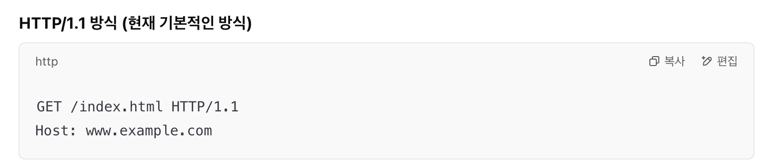

# 2.3 HTTP는 상태를 유지하지 않는 프로토콜
## http 특성
- 무상태: 상태 유지하지 않음(이전 상태 기억 x) , http 2,3도 마찬가지임.
- 상태 유지: keep alive?
- 범위성(scalability): 무상태성을 통해서 많은 데이터를 빠르고 확실하게 처리함.

## 쿠키
- 도입이유: HTTP 1.1의 무상태성 보완. 상태유지 기능 필요
- 예) 로그인 상태 유지

---
# 2.4 리퀘스트 URI로 리소스를 식별
HTTP는 URI를 사용하여 인터넷 상의 리소스 지정함. URI 덕분에 인터넷상의 어떤 장소에 있는 어떤 리소스도 호출 가능

## request URI 종류
1. 모든 URI를 리퀘스트 URI에 포함시킴
2. Host 헤더 필드에 네트워크 로케이션을 포함시킴.

HTTP 1.0에서 모든 URI를 리퀘스트 URI에 포함시킴를 사용하다가, 

HTTP 1.1이 되면서 2. Host 헤더 필드에 네트워크 로케이션을 포함시킴.으로 변화함.

## 이유
HTTP/1.1에서 Host 헤더를 분리하는 것이 가상 호스팅(Virtual Hosting)을 더 편하게 만들기 위해서임.
정확하게는 Host 헤더 사용이 표준화 된 것임. 

>
> 가상 호스팅(Virtual Hosting)이란?
가상 호스팅은 하나의 IP 주소에서 여러 개의 도메인을 운영하는 방식이야.
예를 들어, 같은 서버(같은 IP)에 다음과 같은 도메인들을 운영할 수 있어:
> - www.example.com
> - www.test.com
> - www.mywebsite.com

---
# 2.5 서버에 임무를 부여하는 HTTP 메소드
## 종류
- get: 데이터 반환 
- post: 엔티티 전송 (생성)
- put: 파일 전송 (수정)
- DELETE: 파일(리소스) 삭제
- HEAD: 메시지 헤더 취득
- options: 제공하고 있느 메소드의 문의
- trace: 경로 조사
- connect: 프록시에 터널링 요구

> - ### HTTPS 등 암호화 통신을 위해 터널을 생성할 때 → CONNECT 메서드를 사용
> 예: CONNECT example.com:443 HTTP/1.1
프록시가 목적지 서버와의 직접적인 TCP 연결을 열어주고, 이후에는 암호화된 트래픽을 그대로 중계하게 돼.
즉, 프록시는 이후 통신 내용을 볼 수 없고 단순 패킷 전달자 역할만 하는 거지.
> - ### 일반 HTTP 요청(비암호화) 혹은 프록시가 내용을 처리(캐싱, 로깅 등)해야 하는 경우 
> - → GET, POST, PUT 등 일반 메서드 사용
이 때는 클라이언트가 GET /index.html HTTP/1.1 등을 프록시에 직접 보내고, 프록시가 받아서 원 서버로 재요청을 보내.
응답을 받은 뒤, 다시 클라이언트에게 전달하는 식으로 동작하지.

프록시를 쓰는 이유
1. 사내망/기업망 정책
   직접 외부 인터넷으로 나가는 게 차단되어 있음.
   모든 트래픽이 프록시(예: 사내 방화벽, 웹 필터링 서버)를 반드시 거치도록 강제됨.
   하지만 HTTPS(SSL/TLS) 트래픽을 중간에서 다 열어볼 수는 없어(보안 문제).
   그래서 CONNECT 메서드로 “클라이언트와 외부 서버 사이를 ‘암호화된 터널’로 이어줘”라고 프록시에게 요청해.
   이렇게 하면 사내망 정책을 지키면서도, 클라이언트와 서버 간 보안을 유지한 채 외부 통신을 할 수 있어.
   구체 상황
   회사 네트워크에서 구글, 깃허브 같은 HTTPS 사이트에 접속할 때.
   프록시는 접근 권한, 시간대, 트래픽 양 등을 도메인 차원에서 통제·로깅할 수 있지만, 패킷을 뜯어보지는 못해.
   이게 가능한 건 프록시가 CONNECT로 TCP 터널만 제공하기 때문이야.
2. 방화벽 우회 또는 특정 포트만 허용된 환경
   어떤 방화벽은 443(HTTPS) 포트만 열어두고, 다른 포트는 막을 수 있어.
   그런데 **다른 프로토콜(예: WebSocket, SSH, VNC 등)**을 써야 할 때가 있지.
   직접 22번(SSH) 포트나 8080번(WebSocket) 포트로는 연결 안 될 수도 있어.
   이럴 때 프록시 서버가 443 포트를 통해 CONNECT 메서드로 목적지와 터널을 맺어주면, “HTTPS인 척” 하고 다른 프로토콜을 사용할 수도 있어(실제로는 암호화 트래픽을 그대로 실어 나르기 때문에 가능).
   구체 상황
   대학 기숙사나 카페 와이파이에서 SSH가 막혀 있을 때, 443 포트로 SSH 터널링을 해야 하는 경우.
   클라이언트: “CONNECT my-ssh-server.com:443” → 프록시: “OK, 터널 열었어” → 실제로는 SSH 데이터가 443 포트에서 흘러감.
   방화벽은 이걸 HTTPS 트래픽으로 간주할 수 있고, 내부 내용을 볼 수 없으니 제어가 어려움.
3. 로깅, 접속 제어, 도메인 기반 필터링
   어떤 조직에서는 어느 서버에 접속했는지 기록(Log)하거나, 특정 도메인을 차단하고 싶어.
   HTTP 프록시라면, GET/POST 요청을 확인해 쉽게 필터링할 수 있지만, HTTPS는 암호화 때문에 내용이 보이지 않아.
   그래도 CONNECT 요청의 Host 헤더에 적힌 도메인 정도는 알 수 있어.
   프록시는 “이 도메인은 허용/차단” 결정만 내리고, 차단 대상이 아니면 터널을 열어줘.
   터널 생성 후의 실제 콘텐츠(패킷)는 여전히 암호화되어 있어서 들여다보진 못해도, 접속 여부, 도메인 정보만으로도 충분히 정책을 적용할 수 있어.
   구체 상황
   사내 프록시에서 유튜브, 페이스북 등 차단 목록에 있는 도메인 접속을 막아둠.
   CONNECT 시도 시 Host를 보고 차단 목록에 있으면 바로 “403 Forbidden” 응답.
   차단 목록에 없으면 200 Connection Established로 터널 생성.
4. 캐싱/중간자 프록시(MITM)를 위한 기반
   사실 사내 정책에 따라, 프록시가 인증서를 강제로 바꿔치기(MITM) 해서 HTTPS를 해독·검열하는 방식도 있어.
   이건 CONNECT로 터널을 맺은 뒤에도, 기업이 신뢰하도록 만들어진 사내 루트 인증서를 사용해 프록시가 일종의 ‘가짜 HTTPS’ 세션을 맺는 거야.
   일반 사용자가 체감하기 어렵지만, 브라우저 인증서 목록에 사내 루트 CA가 깔려 있다면, 사실상 프록시는 HTTPS를 복호화해볼 수 있음.
   이것도 근본적으로는 CONNECT 기반 터널을 통해 동작하게 돼.
---
# 2.6 메소드를 사용해서 지시를 내리다

---
# 질문
- keep alive 하면 어떻게 상태 유지됨? 유지된다는게 어떤 의미임?
- 쿠키와 세션 차이점은 뭐임?
- trace 메소드와 cross site tracing? 
- 같은 호스트에 다른 ip로 할 수 있는 방법은?