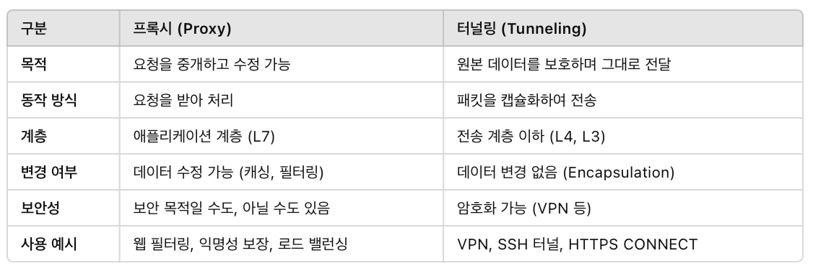

# 5.1 1대로 멀티 도메인을 가능하게 하는 가상 호스트
가상호스트를 사용하면 하나의 물리적인 서버로 여러개의 웹 사이트를 실행할 수 있다.

우리는 도메인 명으로 보통 접근하는데, 서버에 도착하는 시점에서는 DNS에 의해서 ip로 변경됨. 

# 5.2 통신을 중계하는 프로그램: 프록시, 게이트웨이, 터널
- 프록시: 서버, 클라이언트 양쪽 모두를 중계함. 프록시 서버를 여러대 두는 것도 가능함.
  - 사용 이유: 캐시 사용해서 네트워크 대역 등을 효율적으로 사용하는 것
  - 조직 내에 특정 웹 사이트에 대한 액세스 재한
  - 엑세스 로그 획득 등의 정책
  - 종류
    - 캐싱 유무
    - 로깅
    - 메시지 변경 유무: 변경하지 않으면 투명 프록시임. 변경하면 비투과 프록시임.
- 게이트웨이: 적절한 클라이언트한테 요청을 중계함
  - 역할: 서로 다른 네트워크 간 데이터 변환 및 중계, 프로토콜 변환시 사용.
    - 요청 단일진입점 제공
    - 로드 밸런싱 & 트래픽 관리
    - 인증, 인가를 여기서 한다.
    - 로깅 & 모니터링
  - 보안성: 보안기능이 있지만 기본적으로는 라우팅 역할
  - 예제: API 게이트웨이
  - 외부 서버와 연결할 때 한번 분리해주는 역할임. 이게 없으면 본 서버로 바로 들어오니깐 서버에 장애가 생길 경우 치명적일 수 있음.
  - 공적처방전 서버도 gateWay의 역할을 하는 것임. 
- 터널: 서로 떨어진 두 대의 클라이언트와 서버 사이를 중계하며 접속을 주선하는 중계프로그램임.
  - 역할: 데이터를 캡슐화해서 전송
  - 보안성: 암호화 및 캡슐화 지원 가능
  - 예시: VPN 

# 5.3 리소스를 보관하는 캐시
## 5.3.1 캐시는 유효기간이 있다.
캐싱은 서버, 클라이언트 모두 가능하다.
---
## 질문
- 외부 서버와 연동할 때는 꼭 게이트웨이 서버를 둬야할까?
- 터널이뭐야?
  - 암호화 등으로 다른 서버와 연결할 때 안정성 확보
- 그럼 터널이면서 게이트웨이일 수 있는 건가? 터널하고 게이트웨이하고 뭐가 다른 거야?
- 