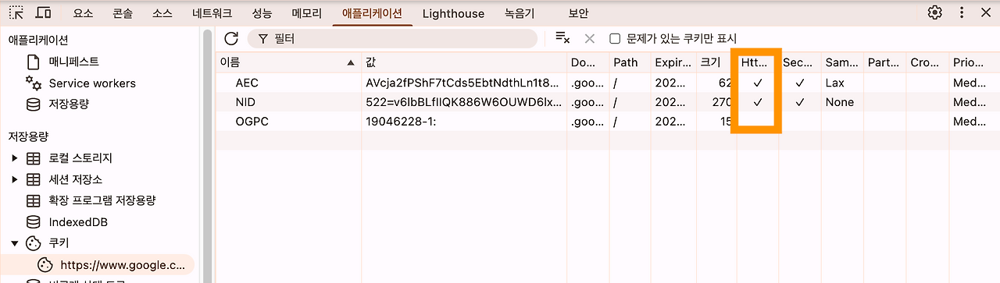
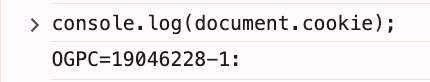

### **6.7. 쿠키를 위한 헤더 필드**

[**RFC 6265**](https://www.rfc-editor.org/rfc/rfc6265 "RFC 6265")는 **IETF(국제 인터넷 표준화 기구**)에서 정의한 **쿠키(Cookie)의 공식 표준 문서**이다.  

**1️⃣ 쿠키의 생성 및 사용**

-   Set-Cookie : 쿠키를 설정하는 방식
-   Cookie : 클라이언트가 서버에 쿠키를 전달하는 방식

**2️⃣ 보안 관련 규칙**

-   **Secure**: HTTPS 연결에서만 쿠키를 전송하도록 제한
-   **HttpOnly**: JavaScript에서 쿠키 접근을 막아 XSS(크로스 사이트 스크립팅) 공격을 방지

**3️⃣ 쿠키 속성**

-   **Domain**: 쿠키를 사용할 도메인 지정
-   **Path**: 특정 경로에서만 쿠키를 전송하도록 제한
-   **Max-Age/Expires**: 쿠키의 유효 기간 설정

➡️ 최신 버전으로는 RFC 6265bis 개정안 존재한다. ( SamSIte 속성 개선 )

### **6.7.1.  Set-Cookie** 

일반적인 HTTP 헤더는 ","를 이용해서 여러 값을 하나로 합칠 수 있었다.

```
Cache-Control: no-store
Cache-Control: no-cache

//합쳐서 보낼경우
Cache-Control: no-store, no-cache
```

하지만, Set -Cookie 헤더의 속성 중 Expires는 날짜를 설정하는데, 날짜 형식에서 ","가 사용된다.

```
Set-Cookie: sessionId=abc123; Expires=Wed, 21 Oct 2025 07:28:00 GMT; Path=/;
```

그렇기에, Set-Cookie 헤더는 1개에 1개의 쿠키만 설정하고 하나로 합치면 안된다.

여러개의 쿠키를 저장해야할 경우 여러개의 Set-Cookie 헤더를 사용할 것을 권장하고 있다.

```
Set-Cookie: <cookie-name>=<cookie-value>; [옵션]
```

-   cookie-name: 쿠키의 이름  
    → **제어 문자(Control Character), 공백(Space), 탭(Tab)을 제외한 ASCII 문자만 가능**  
    → 특수 문자(예: , ; " \\ 등)는 사용할 수 없음.
-   cookie-value: 쿠키에 저장할 값  
    → 일반적으로 URL 인코딩된 값이 들어감.

**🔹 쿠키 이름의 접두사(Prefix)를 통한 보안 옵션 적용**

쿠키 이름 앞에 특정한 **접두사(****\_\_Secure-, \_\_Host-****)**를 붙이면 **추가적인 보안 규칙**이 적용된다.

✅ **1. \_\_Secure- (보안 쿠키)**

```
Set-Cookie: __Secure-session=abc123; Secure; Path=/; HttpOnly;
```

\_\_Secure- → **HTTPS에서만 쿠키를 설정할 수 있다.** (HTTP에서는 Set-Cookie자체가 차단됨).

✅ 2**. \_\_Host- (더 강력한 보안 쿠키)**

```
Set-Cookie: __Host-session=xyz789; Secure; Path=/; HttpOnly;
```

-   도메인을 지정하면 안 됨 (Domain 속성을 사용하면 안 됨)
-   Path는 반드시 / 로 설정 (서브 디렉터리 제한 불가)
-   **서브도메인에서 쿠키가 공유되지 않도록 제한하려면 \_\_Host-를 사용하면 된다.**

#### **1️⃣ Expires 속성**

```
Set-Cookie: <cookie-name>=<cookie-value>; Expires=<date>
```

Expires 속성은 **쿠키가 언제 만료될지를 설정하는 속성**이다.

설정된 시간 이후에는 브라우저가 해당 쿠키를 자동으로 삭제된다. **절대 시간(UTC 기준 날짜 & 시간)으로 지정된다.**

Expires 속성이 없으면 **쿠키는 브라우저가 종료될 때까지 유지**된다. => **세션쿠키**

**즉, Expires를 설정하면 "영구 쿠키(Persistent Cookie)", 없으면 "세션 쿠키(Session Cookie)".**

**Max-Age**와 함께 사용하면 **최신 브라우저와 구형 브라우저 모두에서 호환성 보장 가능**하다. 참고로, Expires와 Max-Age속성이 동시에 설정되면, Max-Age가 우선순위를 가집니다.

#### **2️⃣ Path 속성**

```
Set-Cookie: <cookie-name>=<cookie-value>; Path=<path-value>
```

Path 속성은 **쿠키가 어느 URL 경로에서 유효한지를 정하는 속성**이다.

Path 속성을 명시하지 않으면 **기본적으로 현재 URL의 경로에서만 유효하다.**

Path =/; 로 설정하면 사이트 전체에서 쿠키 사용이 가능하다.

Path=/admin; 로 설정하면 하위 경로(/admin/settings, /admin/users)에서만 쿠키가 전송된다.

#### **3️⃣ Domain 속성**

```
Set-Cookie: <cookie-name>=<cookie-value>; Domain=<domain-value>
```

Domain 속성은 **쿠키가 어느 도메인에서 유효한지를 정하는 속성**이다.

 이 속성을 설정하면 해당 도메인과 **서브도메인(subdomain)**에서도 쿠키를 사용할 수 있다

예를 들어서, [https://naver.com](https://naver.com) 으로 속성을 설정하면, 서브도메인인 [https://section.blog.naver.com/](https://section.blog.naver.com/) 도 사용가능하다.

#### **4️⃣ Secure 속성**

Secure 속성은 **쿠키가 HTTPS에서만 전송되도록 강제하는 속성**이다.

Secure가 없으면 **HTTP에서도 쿠키가 전송될 수 있어 중간자 공격(MITM)에 취약하다.**

| 속성 | Secure 속성 | \_\_Secure- 쿠키 |
| --- | --- | --- |
| 역할 | HTTPS에서만 쿠키를 전송 | HTTPS에서만 쿠키 설정이 가능 |
| HTTP에서 사용 가능 여부 | ❌ (HTTP에서 쿠키 전송 불가) | ❌ (HTTP에서 Set-Cookie 자체가 차단됨) |

#### **5️⃣ HttpOnly 속성**

HttpOnly 속성은 **쿠키를 JavaScript에서 접근하지 못하도록 막는 속성**이다.

즉, HttpOnly가 설정된 쿠키는 **document.cookie를 통해 읽을 수 없고, 오직 서버와의 HTTP 요청을 통해서만 전송된다.**

그래서 사진과 보이는것과 같이 HttpOnly를 설정할 경우, console.log(document.cookie) 사용시 출력되지 않는다.

그렇기에 XSS(크로스사이트 스크립팅) 공격을 방지 할 수 있다.




#### **6️⃣ SamSite 속성**

SameSite 속성은 **쿠키가 크로스 사이트 요청(다른 도메인에서의 요청)에서 전송될지 여부를 결정하는 속성**이다.  
즉, **CSRF(크로스 사이트 요청 위조) 공격을 방지하기 위해 쿠키의 동작을 제한하는 역할**을 한다.

-   SameSite를 설정하지 않으면 브라우저 기본값(Lax)이 적용됨.
-   SameSite=None을 사용할 경우 Secure 속성이 필수임.

| **Strict** | 가장 강력한 보안, 크로스 사이트 요청에서 쿠키 전송 안 됨 | **최고 수준의 보안이 필요한 로그인 세션** |
| --- | --- | --- |
| **Lax** (기본값) | GET 요청에서는 쿠키 전송됨, CSRF 공격 방어 | **보안 & UX 균형 (일반적인 로그인 유지)** |
| **None** | 모든 요청에서 쿠키 전송됨 (단, Secure 필수) | **크로스 사이트 인증, 광고, 결제 서비스** |

### **6.7.2.  Cookie 헤더**

Cookie 헤더는 **클라이언트(브라우저)가 서버로 쿠키 데이터를 전송할 때 사용하는 HTTP 요청 헤더**이다.

사용자가 방문한 웹사이트에서 설정한 쿠키가 요청과 함께 자동으로 전송된다.

```
GET /dashboard HTTP/1.1
Host: example.com
Cookie: sessionId=abc123;
```

**🔹 Cookie 헤더와 Set-Cookie 차이점**

| Set-Cookie | 서버 → 클라이언트 | 서버가 클라이언트에 쿠키 저장 요청 |
| --- | --- | --- |
| Cookie | 클라이언트 → 서버 | 클라이언트가 서버에 저장된 쿠키 전달 |

---

### **6.8. 그 이외의 헤더 필드**

### **6.8.1. X-Frame-Options** 

X-Frame-Options 헤더는 **웹사이트가 iframe, object, embed 태그를 통해 다른 사이트에 포함되는 것을 제한하는 HTTP 응답 헤더**다.   
이를 통해  **클릭재킹(Clickjacking) 공격을 방지**할 수 있다.

클릭재킹(Clickjacking)은 **사용자가 본인도 모르게 악성 사이트에서 특정 버튼이나 링크를 클릭하도록 유도하는 공격 기법**이다.  
공격자는 보통 <iframe>을 사용해 사용자가 원치 않는 행동(예: 계정 탈취, 결제, 권한 변경 등)을 하게 만든다

| **헤더 옵션** | **보안** | **설명** |
| --- | --- | --- |
| **DENY** | ✅ 강력 추천 | **어떤 경우에도 <iframe> 안에서 페이지 로딩 차단** (가장 강력한 보안) |
| **SAMEORIGIN** | ✅ 추천 | **같은 도메인에서만 <iframe> 허용** (자사 서비스 내에서는 허용 가능) |
| **ALLOW-FROM <URL>** | ❌ 비추천   \=> CSP 사용 추천 | **지원하는 브라우저가 거의 없음**, 대신 frame-ancestors 사용하여 대체가 가능하다. |

### **6.8.2.** **X-XSS-Protection** 

X-XSS-Protection은 **브라우저에서 XSS(크로스사이트 스크립팅) 공격을 탐지하고 차단하는 HTTP 응답 헤더**다.  
과거에는 브라우저가 자동으로 XSS 공격을 탐지하고 차단하는 기능을 제공했지만, **현재 대부분의 최신 브라우저에서는 이 기능이 제거**되었거나 Content-Security-Policy (CSP)를 사용하는 것이 권장되고 있다.

| **헤더 값** | 설명 |
| --- | --- |
| **0** | XSS 보호 기능 끄기 |
| **1** | XSS 보호 기능 켜기 |

### **6.8.3. DNT**

DNT(Do Not Track) 헤더는 **사용자가 웹사이트 및 광고 네트워크에 대해 자신의 온라인 활동 추적을 원하지 않는다는 의사를 전달하는 HTTP 요청 헤더**다.

현재는 **대부분의 최신 브라우저에서 지원을 중단하고 웹 표준에서도 제외**된다.

| **헤더 값** | **의미** |
| --- | --- |
| **0** | 사용자가 추적을 허용함  |
| **1** | 사용자가 추적을 거부함  |

### **6.8.4. P3P**

P3P(Platform for Privacy Preferences)는 **웹사이트가 사용자의 개인정보 보호 정책을 XML 형식으로 기술하여 브라우저가 이를 자동으로 해석할 수 있도록 하는 W3C 표준**이었다.

사용자는 P3P를 통해 **자신의 개인정보가 어떻게 사용될지 미리 알 수 있도록 설계**되었으나, 이것또한,, 잘 사용하지 않는 기술이라고 한다.