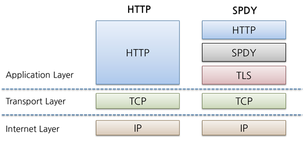

### **9.1. HTTP를 기본으로 하는 프로토콜**

HTTP이 부족하다고 한다면 그것을 보완하는 전혀 새로운 프토토콜을 만들수있지만, 이미 웹 브라우저 환경이 널리 퍼진 HTTP 프로토콜을 무시할 수 없다. 그래서 HTTP를 기반으로 해서 **HTTP 위에서 동작하는 새로운 프로토콜들이 개발되었다.** 대표적인 예로 **WebSocket, SPDY, HTTP/2, HTTP/3, QUIC, WebRTC 등**이 있다.

---

### **9.2. HTTP의 병목 현상을 해소하는 SPDY**

**SPDY**(Speedy) 는 구글이 개발한 애플리케이션 계층 프로토콜로, **HTTP의 병목현상을 해결**하기 위해 만들어졌는데 이것이 **HTTP/2의 기반**이 되었다.

#### 🔹**9.2.1. HTTP의 병목 현상**

HTTP 병목현상은 웹페이지를 로딩할 때 **특정 리소스가 늦게 로딩되거나**, **여러 개의 요청이 동시에 처리되지 않아서 발생하는 속도 저하 문제**를 의미한다.  
 HTTP/1.1에서는 **네트워크 연결 개수 제한, 요청당 오버헤드 증가, 리소스 차단(Blockage)** 같은 이유로 병목이 발생한다.

#### **🔹 AJAX를 사용한 HTTP 병목 해결 방법**

-   AJAX는 **비동기 요청을 처리하는 기술**로, 웹페이지 전체를 다시 로딩하지 않고 **서버와 데이터를 주고받을 수 있다.**
-   대표적인 사용 예: **Google 검색 자동완성, 실시간 채팅, 페이지 일부 갱신(예: 댓글 추가)**

**🚀 AJAX의 장점**

-   1️⃣ 페이지 전체가 아닌 필요한 데이터만 요청 → 네트워크 부하 감소
-   2️⃣ 비동기 요청으로 서버의 요청을 기다리지 않고 다른 작업 수행 가능 
-   3️⃣ 디바운싱( 입력이 멈춘 후 요청 실행 )과 쓰로틀링( 이벤트가 짧은 간격으로 반복적으로 발생하더라도 설정한 시간으로 한번만 실행 ) 을 적용하여 과도한 요청 방지가 가능하다.

**⚠️** **AJAX의 단점**

-   1️⃣ 과도한 AJAX 요청이 서버 부하를 증가하고 응답 속도가 느려질 수 있다.
-   2️⃣ 여러 개의 AJAX 요청이 동시에 발생하면, 응답의 순서 보장이 어렵다.

#### **🔹** **Comet을 사용한 해결 방법**

AJAX는 주기적으로 서버에 요청을 보내는 방식이지만, **Comet은 서버에서 클라이언트로 데이터를 푸시(Push)하는 방식**이다.

-   Comet은 **서버가 클라이언트에게 먼저 데이터를 보낼 수도 있다.** \=> **"요청을 오래 유지하는 것"** (Long Polling 또는 Streaming)
-   이를 통해 **실시간 채팅, 실시간 알림 같은 기능을 구현할 수 있다.**

**1️⃣ Long Polling (긴 폴링)**

클라이언트가 서버에 요청을 보낸 후, **서버가 즉시 응답하지 않고 새로운 데이터가 생길때까지 요청을 유지하는 방식**이다.

응답을 받은 후 클라이어트는 즉시 새로운 요청을 보낸다.

-   👍 : AJAX Polling은 **정해진 시간마다 무조건 요청**을 보내지만, Long Polling은 **필요할 때만 응답을 보내므로 불필요한 요청이 줄어든다.**
-   👎 : 다만, 서버가 많은 요청을 동시에 처리해야하므로 **부하가 증가**하고, **연결이 끊어질 경우 클라이언트가 다시 요청**해야한다.

**2️⃣ Streaming (스트리밍 방식)**

서버가 클라이언트의 요청을 받으면 **연결을 닫지 않고 유지하면서 데이터가 생길때마다 보내는 방식**이다.

-   👍 : 연결을 계속 유지하므로 요청- 응답 반복이 필요없어서 **네트워크 비용이 감소하고, 실시간으로 데이터를 받을 수 있다.**
-   👎 : 하지만, 연결이 오래 유지 되므로 **서버의 리소스를 많이 사용**하고, 일반적을 HTTP 요청과 다르므로 **브라우저나 프록시 서버에서는 문제가 발생**할 수 있다.

#### 🔹**9.2.2. SPDY 설계와 기능**

HTTP/1.1과 AJAX, Comet을 사용해도 근본적인 병목 문제를 해결할 수 없다. 하지만 웹은 이미 HTTP 기반으로 구축되어 있어서, HTTP 자체를 바꾸는 것은 현실적으로 어려움이 있었다.  
이를 해결하기 위해 Google이 **SPDY(Speedy) 프로토콜을 개발**했다.  
SPDY는 **애플리케이션 계층(HTTP)과 전송 계층(TCP) 사이에서 동작하는 프로토콜로 설계****로 설계**되었으며, 기존 HTTP의 구조를 유지하면서 성능을 개선하는 방식으로 동작했다.  
SPDY의 핵심 기술은 **멀티플렉싱, 헤더 압축, 요청 우선순위 지정** 등이 있다.  
나중에 HTTP/2가 SPDY의 개념을 채택하여 표준화되면서, SPDY는 더 이상 사용되지 않는다(2016년 이후 Chrome, Firefox 등에서 지원 종료).



1️⃣ **다중 스트리밍**

-   **여러 개의 HTTP 요청/응답을 하나의 TCP 연결에서 동시에 처리하는 기능**
-   HTTP/1.1에서는 요청 하나당 하나의 TCP 연결이 필요했지만, SPDY는 **하나의 TCP 연결에서 여러 개의 HTTP 요청을 병렬로 처리**할 수 있다.
-   결과적으로 **연결 개수를 줄이고(TCP 연결 오버헤드 감소), 대역폭 사용률을 높인다.**

**2️⃣ 우선순위 부여 :** 기본적으로 SPDY와 HTTP/2에서는 여러 개의 요청을 동시에 보내기에 **어떤 요청이 더 중요한지 판단할 필요**가 있다.

3️⃣ **헤더 압축 (Header Compression) :** 요청 크기를 줄여서 서버 부하를 줄일 수 있다.

**4️⃣ 서버 푸시 (Server Push)** 서버는 클라이언트가 요청하지 않은 리소스를 푸쉬 스트림(Push Stream)를 통해 미리 보내줄 수 있다.

**\=> 동작 과정 예시:**

1.  클라이언트가 index.html을 요청함.
2.  서버는 index.html을 응답하면서 추가적으로 필요한 style.css, script.js 등을 **푸쉬 스트림**을 통해 같이 전송함.
3.  클라이언트는 추가 HTTP 요청 없이 푸쉬된 리소스를 사용할 수 있음.

5️⃣ **서버 힌트**

서버 힌트(Server Hint)는 **서버가 클라이언트(브라우저)에게 특정 리소스를 미리 요청하도록 유도하는 방식**이다.  
즉, 서버가 직접 리소스를 푸쉬하는 **HTTP/2 서버 푸쉬와는 다르게**, 클라이언트가 리소스를 필요로 할 가능성이 높다고 미리 알려주는 방식이다.

---

### **9.3. 브라우저에서 양방향 통신을 하는 WebSocket**

**WebSocket**은 **클라이언트(브라우저)와 서버가 양방향(Full-Duplex)으로 실시간 데이터를 주고받을 수 있는 통신 프로토콜**이다.  
기존 HTTP 요청-응답 방식과 다르게 **한 번 연결되면 계속해서 데이터를 주고받을 수 있는 지속적인 연결을 유지**한다

**1️⃣ 양방향 통신 (Full-Duplex) :** 클라이언트와 서버가 **동시에 데이터를 주고받을 수 있다.**

**2️⃣ 지속적인 연결 유지 :** 한 번 연결을 맺으면 계속 유지되며, **추가적인 요청 없이 서버가 데이터를 클라이언트에게 보낼 수 있다.**

**3️⃣ 헤더 오버헤드 감소 :** HTTP 요청-응답마다 헤더를 포함해야 하지만, WebSocket은 **한 번 연결 후 데이터 프레임만 전송**하여 오버헤드가 적다.

**4️⃣ 프록시 터널링 가능 :** WebSocket은 일반적으로 **HTTP(S) 포트(80, 443)**를 사용하기 때문에 **방화벽, 프록시 우회가 가능**

5️⃣ 핸드쉐이크/ 리퀘스트 + 핸드쉐이크/ 리스폰스 :

WebSocket 핸드셰이크(Handshake)는 **클라이언트(브라우저)와 서버가 WebSocket 연결을 설정하는 과정**이다.

[##_Image|kage@nHYhB/btsMEBfuzR6/ECTg8T8zz3Nztx7z1dbVsK/img.webp|CDM|1.3|{"originWidth":512,"originHeight":376,"style":"alignCenter","caption":"https://velog.io/@codingbotpark/Web-Socket-이란"}_##]

1) 클라이언트가 WebSocket 연결 요청 ( HTTP 요청 )

```
GET /chat HTTP/1.1
Host: example.com
Upgrade: websocket -- WebSocket으로 연결을 업그레이드 요청 
Connection: Upgrade-- 프로토콜 변경을 요청
Sec-WebSocket-Key: x3JJHMbDL1EzLkh9YZrdmA== --클라이언트가 보낸 난수 값 (보안 목적)
Sec-WebSocket-Version: 13 --WebSocket 프로토콜 버전
```

2) 서버가 WebSocket 연결 승일( HTTP 응답 )

```
HTTP/1.1 101 Switching Protocols --HTTP에서 WebSocket으로 프로토콜 변경 완료
Upgrade: websocket
Connection: Upgrade
Sec-WebSocket-Accept: HSmrc0sMlYUkAGmm5OPpG2HaGWk= --클라이언트의 Sec-WebSocket-Key를 기반으로 생성한 응답 값
```

3) WebSocket 연결 완료 (양방향 통신 가능) : 핸드셰이크가 성공하면 **이제부터는 WebSocket 데이터 프레임을 사용하여 실시간 통신 가능**

**※ 참고 ※**

WebSocket은 HTML5 이후에 나온 기술이기때문에 HTML5 이전의 기술로 구현된 서비스에서는 WebSocket을 사용할 수 없었다.  
이런 문제를 해결하기 위해 등장한 것이 Socket.IO, SockJS 와 같이 HTML5 이전의 기술로 구현된 서비스에서 웹소케처럼 사용할 수 있도록 도와준다.

### **9.4. 등장이 기다려지는 HTTP/2.0**

| **기술** | **HTTP/2에 기여한점** |
| --- | --- |
| **SPDY** | 요청 다중화, 헤더 압축, 서버 푸쉬 도입 |
| **HTTP Speed+Mobility** | 모바일 환경 최적화, 네트워크 변경 대응, 패킷 손실 복구 |
| **Network-Friendly HTTP Upgrade** | 기존 HTTP/1.1에서 자연스럽게 HTTP/2로 전환 가능 |

### **9.5. 웹 서버 상의 파일을 관리하는 WebDav**

WebDAV(Web Distributed Authoring and Versioning)는 **HTTP를 확장하여 파일을 원격으로 저장하고 편집할 수 있도록 만든 프로토콜**이다.  
즉, **웹을 통해 파일을 업로드/다운로드하고, 공동 작업을 할 수 있도록 지원하는 HTTP 기반 기술**이다.

WebDAV는 기존 HTTP 프로토콜을 확장하여 **파일 관리 기능을 추가**했다.  
이를 통해 사용자는 **웹을 통해 파일을 편집, 업로드, 삭제할 수 있다.**

-   WebDAV는 **HTTP PUT, DELETE 메서드를 지원하여** 클라이언트가 서버에 파일을 업로드/다운로드할 수 있음.
-   FTP처럼 별도의 파일 전송 프로토콜이 필요 없이 **HTTP 기반으로 파일을 주고받을 수 있다.**