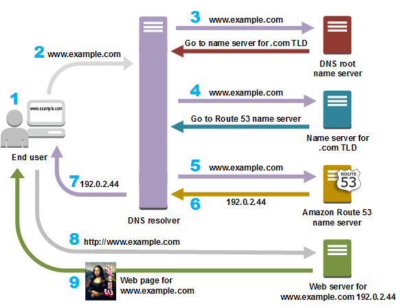
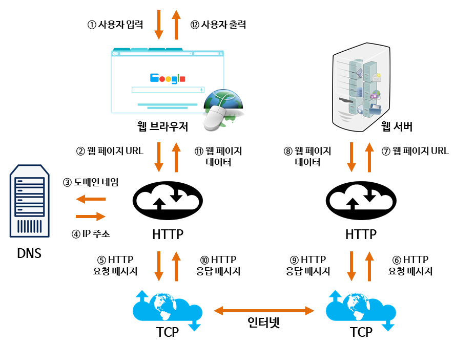
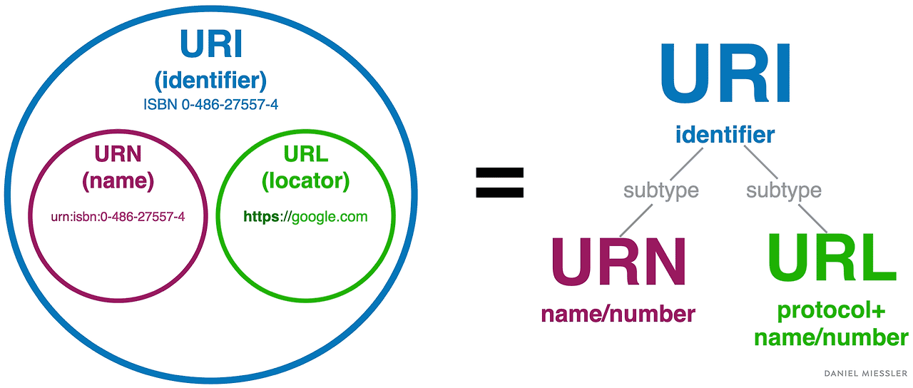

## 1.5. 이름 해결을 담당하는 DNS

DNS는 **도메인 네임 시스템(Domain Name System)**의 약자로, 사람이 이해하기 쉬운 도메인 이름(예: `google.com`)을  
컴퓨터가 이해할 수 있는 **IP 주소**(예: `142.250.191.46`)로 변환하는 시스템입니다.

---

### 🔹 DNS가 필요한 이유
✔ 인터넷에서는 모든 장치가 **IP 주소**를 사용하여 서로 통신합니다.  
✔ 하지만 숫자로 된 IP 주소를 직접 외우고 입력하는 것은 불편합니다.  
✔ **DNS를 이용하면 사람이 친숙한 도메인 이름을 입력하면 자동으로 해당 IP 주소로 변환됩니다.**

---

### 🔹 DNS의 포트 번호
DNS는 **UDP 53번 포트와 TCP 53번 포트**를 사용합니다.  

- 일반적인 조회는 **UDP 53번 포트**를 사용하여 빠르게 데이터를 처리합니다.  
- **512바이트를 초과하는 응답이 필요할 경우**에는 **TCP 53번 포트**로 전환됩니다.  
- **UDP가 차단되거나 실패한 경우에도 TCP가 사용될 수 있습니다.**

---

### 🔹 DNS 동작 과정
1️⃣ **사용자 입력** → 사용자가 `www.example.com`을 입력  
2️⃣ **DNS Resolver 요청** → 브라우저 & OS 캐시에 DNS 정보가 없으면, 요청이 ISP의 DNS Resolver로 전달  
3️⃣ **Root Name Server 질의** → Resolver가 **루트 네임서버에 `.com` 도메인 정보 요청**  
4️⃣ **TLD Name Server 질의** → 루트 네임서버가 `.com` TLD 네임서버의 위치를 알려주고, Resolver가 다시 요청  
5️⃣ **Authoritative Name Server 질의** → TLD 네임서버가 **권한 네임서버(Route 53 등)**로 안내  
6️⃣ **IP 주소 반환** → 권한 네임서버가 요청받은 도메인의 **IP 주소(예: `192.0.2.44`)**를 반환  
7️⃣ **Resolver가 IP 주소 반환** → Resolver가 최종적으로 사용자의 브라우저에 IP 주소를 반환  
8️⃣ **웹 서버 요청** → 브라우저가 반환받은 IP 주소를 사용하여 웹 서버에 연결  
9️⃣ **웹 페이지 표시** → 웹 서버가 요청받은 데이터를 반환하고, 사용자는 웹 페이지를 확인

> 📌 **DNS 요청 흐름 요약**  
> 1. 사용자 → 브라우저 & OS 캐시 확인 → ISP의 DNS Resolver  
> 2. Resolver → 루트 네임서버 → TLD 네임서버 → 권한 네임서버  
> 3. 권한 네임서버 → 최종 IP 반환 → 브라우저 → 웹 서버 접속 → 웹 페이지 표시  

<p align="center">
  
</p>

🔗 **출처**: [what-is-dns](https://aws.amazon.com/ko/route53/what-is-dns/)


---

## 🔹 DNS 서버

### ✅ **DNS 서버를 분리하는 이유**
✔ **효율적인 데이터 처리**  
✔ **확장성과 분산 구조**로 안정성 보장  
✔ **보안 및 관리 책임 분리**

| **DNS 서버 종류**   | **설명** |
|-----------------|----------------------------------|
| **재귀적 DNS 서버** | 사용자의 요청을 받아 최종 IP 주소를 찾음 (ISP 또는 공용 DNS) |
| **루트 네임서버** | 최상위 DNS 서버, `.com`, `.kr` 등의 **TLD 네임서버 정보 제공** |
| **TLD 네임서버** | `.com`, `.net`, `.kr` 등 **최상위 도메인의 네임서버 정보 제공** |
| **권한 네임서버** | 최종 **IP 주소 정보를 관리**하는 서버 (예: `google.com`의 DNS 서버) |

---

## 🔹 DNS 캐싱
✔ **DNS 응답 속도를 빠르게 하기 위해 캐싱을 사용**합니다.  
✔ 같은 도메인에 대한 요청이 반복될 경우, **이전 조회 결과를 저장하여 불필요한 조회를 줄입니다.**

---

## 🔹 방화벽 연결 확인 (사이트 접속 가능 여부)
✔ **ICMP Echo Request 패킷을 전송하여 응답(Echo Reply)을 받으면 통신이 가능함**  
✔ **ICMP 패킷 차단 여부 확인 가능**  
✔ `ping` 명령어를 이용하여 웹사이트가 응답하는지 확인 가능

```bash
ping google.com
```

---

# **1.6. 각각과 HTTP와의 관계**

<p align="center">
  
</p>

🔗 **출처**: [WEB-동작-원리](https://velog.io/@cmin95/WEB-동작-원리)


> 📌 **최종 요약 (단계별 역할 포함)**  
> 1️⃣ **URL 입력** → 브라우저가 HTTP 요청을 생성  
> 2️⃣ **DNS 조회** → 도메인(`hack.jp`) → IP(`192.168.10.20`) 변환  
> 3️⃣ **TCP 연결** → TCP 3-way Handshake로 연결 구축  
> 4️⃣ **TCP 데이터 쪼개기** → HTTP 요청을 여러 개의 패킷으로 나눔  
> 5️⃣ **IP 패킷 전달** → 패킷을 목적지로 보냄  
> 6️⃣ **라우터** → IP 주소 기반으로 최적의 경로를 찾아 패킷 전달  
> 7️⃣ **서버 도착 → TCP 재조립** → 패킷을 원래의 HTTP 요청으로 복원  

---


# 1.7 URI와 URL

✔ **URI (Uniform Resource Identifier, 통합 자원 식별자)**  
&nbsp;&nbsp;&nbsp;→ **리소스를 식별하는 모든 문자열**을 의미  
✔ **URL과 URN을 포함하는 개념**  
&nbsp;&nbsp;&nbsp;→ 웹 주소뿐만 아니라 **고유 식별자**도 포함됨.  

✔ **URI** = 어떤 리소스를 가리키는 모든 문자열  
✔ **URL** = 리소스의 **위치**를 나타내는 문자열  
✔ **URN** = 리소스의 **고유한 이름** (위치 정보 없음)  

<p align="center">
  
</p>

🔗 **출처**: [URI와 URL의 차이점 - Velog](https://velog.io/@octoberjin11/Network-URI와-URL의-차이점)

---

## 🔹 URI, URL, URN 비교 예시

| **예제** | **URI** | **URL** | **URN** | **설명** |
|----------------------|:----:|:----:|:----:|------------------------------|
| `https://www.example.com/index.html` | ✅ | ✅ | ❌ | 웹페이지의 위치 (URL) |
| `ftp://files.example.com/download.zip` | ✅ | ✅ | ❌ | 파일 다운로드 주소 (URL) |
| `urn:isbn:978-3-16-148410-0` | ✅ | ❌ | ✅ | ISBN 코드 (URN) |
| `urn:uuid:6ba7b810-9dad-11d1-80b4-00c04fd430c8` | ✅ | ❌ | ✅ | UUID (URN, 고유 식별자) |
| `mailto:user@example.com` | ✅ | ❌ | ❌ | 이메일 주소 (위치 X, 고유 식별자 X) |
| `tel:+1-800-555-0199` | ✅ | ❌ | ❌ | 전화번호 (위치 X, 고유 식별자 X) |
| `sms:+1-800-555-0199` | ✅ | ❌ | ❌ | 문자 전송 (위치 X, 고유 식별자 X) |
| `data:text/plain;base64,SGVsbG8gd29ybGQ=` | ✅ | ❌ | ❌ | 인라인 데이터 (위치 X, 고유 이름 X) |

---

# 🔹 URL 포맷

| **구성 요소** | **설명** | **예시** |
|------------|--------------|-------------------------|
| **Scheme (스키마, 프로토콜)** | HTTP, HTTPS, FTP 등 | `https://` |
| **UserInfo (사용자 정보, 선택적)** | 사용자 인증 정보 (아이디, 비밀번호)  보안 문제로 인해 HTTP URL에서는 거의 사용되지 않음 | `user:password@` |
| **Host (호스트, 도메인 or IP)** | 요청 대상 서버 | `www.google.com`, `192.168.1.1` |
| **Port (포트 번호, 선택적)** | 네트워크 포트 | `:443`, `:8080` |
| **Path (경로)** | 서버 내 리소스 위치 | `/index.html` |
| **Query (쿼리 문자열)** | 추가적인 데이터 전달 | `?q=chatgpt` |
| **Fragment (프래그먼트)** | 문서 내 특정 위치 지정 | `#section1` |

---

# 🔹 HTTPS가 해결하는 보안 문제
✔ **HTTPS(HyperText Transfer Protocol Secure)** 는 **HTTP + 보안(SSL/TLS) 기능이 추가된 버전**입니다.  
✔ **SSL/TLS(보안 프로토콜)** 을 사용하여 **데이터를 암호화하고, 인증 및 무결성을 보장합니다.**  

---

# 2장.간단한 프로토콜 HTTP

## **2.1. HTTP 는 클라이언트와 서버 간에 통신을 한다.**

HTTP에서 **클라이언트와 서버의 역할이 명확하게 구분된다**는 말은, 

각 요청(Request)과 응답(Response)에서 클라이언트와 서버의 역할이 고정적이라는 뜻입니다.  
즉, 한 번의 HTTP 통신에서는 요청을 보내는 순간부터 응답이 완료될 때까지는  **클라이언트는 요청을 보내는 쪽**, **서버는 응답을 제공하는 쪽**으로 역할이 고정되어 있습니다.

하지만, 새로운 요청이 발생하면 그때 역할이 변경될 수도 있습니다.

---

## **2.2. 리퀘스트와 리스폰스를 교환하여 성립**

HTTP 통신은 요청(Request)과 응답(Response)을 교환하는 방식으로 이루어집니다.  
즉, 반드시 **클라이언트가 먼저 요청을 보내고, 서버가 응답을 반환**해야만 HTTP 통신이 성립합니다.

### **🔹 HTTP 요청(Request)의 구성요소**

```
GET /index.html HTTP/1.1   ---요청 라인
Host: www.example.com      ---헤더
User-Agent: Mozilla/5.0
Accept: text/html
```

| **요청 요소** | 설명 |
| --- | --- |
| **요청 라인** | 요청 메서드(GET, POST 등) + 요청 URL + HTTP 버전 |
| **헤더(Header)** | 요청과 관련된 추가 정보 (User-Agent, Accept 등) |
| **본문(Body)** | POST 요청 시 전송할 데이터 (GET 요청에는 없음) |

### **🔹 HTTP 응답(Response)의 구성요소**

```
HTTP/1.1 200 OK
Date: Sun, 09 Feb 2025 12:00:00 GMT
Content-Type: text/html
Content-Length: 1234

<html>
  <body>Hello, World!</body>
</html>
```

| **응답 요소** | 설명 |
| --- | --- |
| **상태 라인** | HTTP 버전 + 상태 코드(200, 404 등) + 상태 메시지 |
| **헤더(Header)** | 응답과 관련된 추가 정보 (Content-Type, Date 등) |
| **본문(Body)** | 실제 응답 데이터 (HTML, JSON, 이미지 등) |
